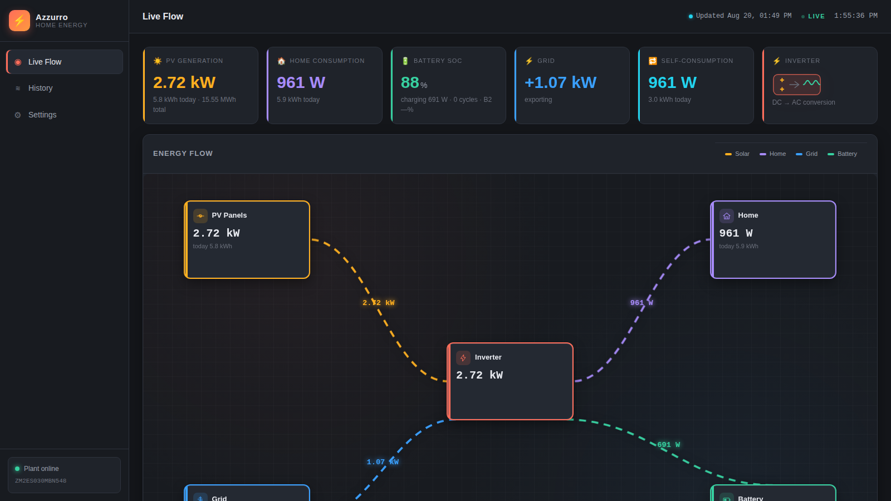

# Azzurro Dashboard

A modern, N8N-style Django web dashboard for your **ZCS Azzurro** home
photovoltaic plant. It talks to the Zucchetti Azzurro third-party portal
through the [`zcslib`](../zcslib) REST client and visualises the live energy
flows, battery state, grid exchange and historical data with animated node
diagrams and charts.

## Features

- **Live energy flow diagram** — an N8N-style node canvas (PV → Inverter →
  Home / Battery / Grid) whose connections light up and animate in the actual
  direction of the current, with live power values on every edge.
- **Realtime KPI cards** — PV generation (today + total), home consumption,
  battery SoC (both batteries) and cycle count, grid import/export,
  self-consumption, refreshed every 10 seconds.
- **Battery gauge + today energy chart** on the dashboard.
- **History & analytics** — pick any range (up to 7 days), get peak summary
  cards and charts for power, battery SoC and per-hour/per-day energy.
- **Local history persistence** — fetched samples are stored in SQLite, so
  previously loaded windows are served from the database without hitting the
  portal again.
- **Settings page** — enter or change the ZCS credentials directly from the UI;
  they are stored **encrypted** in the database.
- **Mock mode** — runs out of the box with realistic synthetic data when ZCS
  credentials are not configured, so the whole UI is explorable.

## Screenshot



## Quick start

```bash
cd azzurro-gui

# 1. virtualenv + dependencies (zcslib is installed from GitHub)
python3 -m venv venv
./venv/bin/pip install -r requirements.txt

# 2. configure your ZCS credentials (optional — without them mock mode kicks in)
cp .env.example .env

# 3. initialise the database
./venv/bin/python manage.py migrate

# 4. run
./venv/bin/python manage.py runserver
```

Then open http://127.0.0.1:8000

## Run with Docker Compose

The project ships a [`Dockerfile`](Dockerfile) and a
[`docker-compose.yml`](docker-compose.yml) so you can run the whole dashboard
with a single command.

```bash
# 1. configure the environment (same file as for local development)
cp .env.example .env

# 2. build and start
docker compose up -d

# 3. open http://localhost:8000
```

- The SQLite database lives in the named volume `sqlite_data`
  (mounted at `/data`), so it survives container restarts and rebuilds.
- Migrations and static-file collection run automatically on container start.
- Credentials entered on the Settings page are stored encrypted in the
  database and persist in the volume.

To stop: `docker compose down`. To stop and wipe the database:
`docker compose down -v`.

## Pages

| Route | Description |
| --- | --- |
| `/` | Live flow dashboard (KPI cards, animated energy flow, battery gauge, today charts) |
| `/history/` | Historical data explorer with charts and peak summaries |
| `/settings/` | Portal settings — enter/change ZCS credentials (stored encrypted in the DB) |
| `/api/realtime/` | JSON realtime snapshot (used by the dashboard poller) |
| `/api/history/?start=&end=` | JSON history between two ISO datetimes |

## ZCS Azzurro credentials

The Azzurro Portal third-party API requires access granted by ZCS support.
From the documentation, you need the following credentials (which you enter on
the Settings page, stored encrypted in the database):

- Thing key — your inverter serial number (printed on the device label).
- Client code / auth code — request them by opening a ticket on
  <https://www.zcsazzurro.com/> ("third-party API access").

Configure them on the **Settings page** (recommended) — open `/settings/` in
the dashboard, type the codes and press *Save*. They are stored **encrypted**
(AES/Fernet keyed from Django's `SECRET_KEY`) in the
`dashboard_zcsconfiguration` table, never in plain text. An empty field keeps
its current value; *Clear credentials* returns to demo mode.

With all three present the dashboard queries the real plant; leave them empty
(or set `ZCS_USE_MOCK=true`) for demo mode.

Credentials are **not** configured through `.env` — they are entered on the
Settings page and stored encrypted in the database. The `.env` file only holds
Django and portal settings:

| Variable | Default | Description |
| --- | --- | --- |
| `DJANGO_DEBUG` | `true` | Django debug mode (set `false` in production) |
| `DJANGO_SECRET_KEY` | insecure dev key | **Set a random value** — it keys the encryption of stored credentials |
| `DJANGO_ALLOWED_HOSTS` | `localhost,127.0.0.1` | Comma-separated hostnames; add your host/IP for production |
| `DJANGO_TIME_ZONE` | `Europe/Rome` | Timezone used for display |
| `DJANGO_DB_PATH` | `./db.sqlite3` | SQLite database path (Docker sets it to `/data/db.sqlite3`) |
| `ZCS_URL` | ZCS portal endpoint | Endpoint used by the ZCS Azzurro devices |
| `ZCS_USE_MOCK` | unset | `true` forces demo mode even with credentials |
| `ZCS_REALTIME_CACHE_TTL` | `30` | Realtime poll cache in seconds |
| `ZCS_MAX_HISTORY_SPAN` | `24` | Max span of a single historic request (hours) |
| `ZCS_MAX_HISTORY_DAYS` | `7` | How far back the history page can look (days) |

> Stored credentials are encrypted with a key derived from `SECRET_KEY`
> (`DJANGO_SECRET_KEY`). If you rotate that key, previously stored credentials
> can no longer be decrypted — re-enter them from `/settings/`.

> The portal allows at most **24h per historic request** and roughly **5-minute
> sampling**. Longer ranges are split automatically; the history page caps the
> range at `ZCS_MAX_HISTORY_DAYS` (default 7).

## Project layout

```
azzurro-gui/
├── azzurro/            # Django project (settings, root urls)
├── dashboard/          # main app
│   ├── services/
│   │   ├── zcs.py          # ZCSService: portal parsing + mock data
│   │   ├── config.py       # effective config (DB-stored credentials)
│   │   ├── crypto.py       # Fernet encryption of stored credentials
│   │   └── persistence.py  # SQLite storage of historical samples
│   ├── models.py           # HistoricSample + ZCSConfiguration (encrypted)
│   ├── views.py            # pages + JSON APIs
│   ├── static/dashboard/
│   │   ├── css/styles.css  # dark N8N-inspired theme
│   │   ├── js/flow.js      # animated SVG energy-flow diagram
│   │   ├── js/dashboard.js
│   │   ├── js/history.js
│   │   └── vendor/echarts.min.js
│   └── templates/dashboard/
├── docs/dashboard.png  # dashboard screenshot
├── .env.example        # copy to .env to configure
├── Dockerfile          # container image (gunicorn + whitenoise)
├── docker-compose.yml  # one-command run with persisted SQLite volume
└── requirements.txt
```

## Tests

```bash
./venv/bin/python manage.py test dashboard
```

## Notes

- ECharts is vendored locally (`static/dashboard/vendor/echarts.min.js`) so the
  app works offline.
- The realtime API is cached server-side for `ZCS_REALTIME_CACHE_TTL` seconds
  (default 30) to limit portal calls.